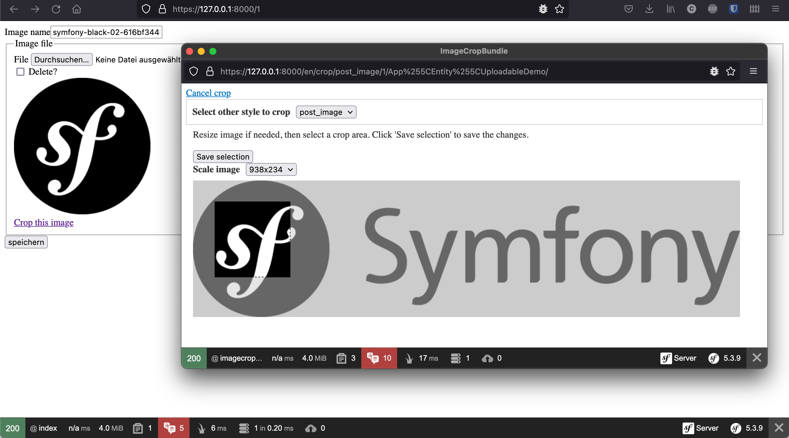

Demo App für Symfony Bundle ImageCrop
=========

Demo for [ImageCropBundle](https://github.com/anacona16/ImageCropBundle)

## Install

    git clone git@github.com:Chris53897/ImageCropBundleDemo.git
    cd ImageCropBundleDemo
    php bin/console d:s:c

## Start Server 

    symfony serve

## Run example

Create an Object and edit it

    https://127.0.0.1:8000/new
    https://127.0.0.1:8000/1
    